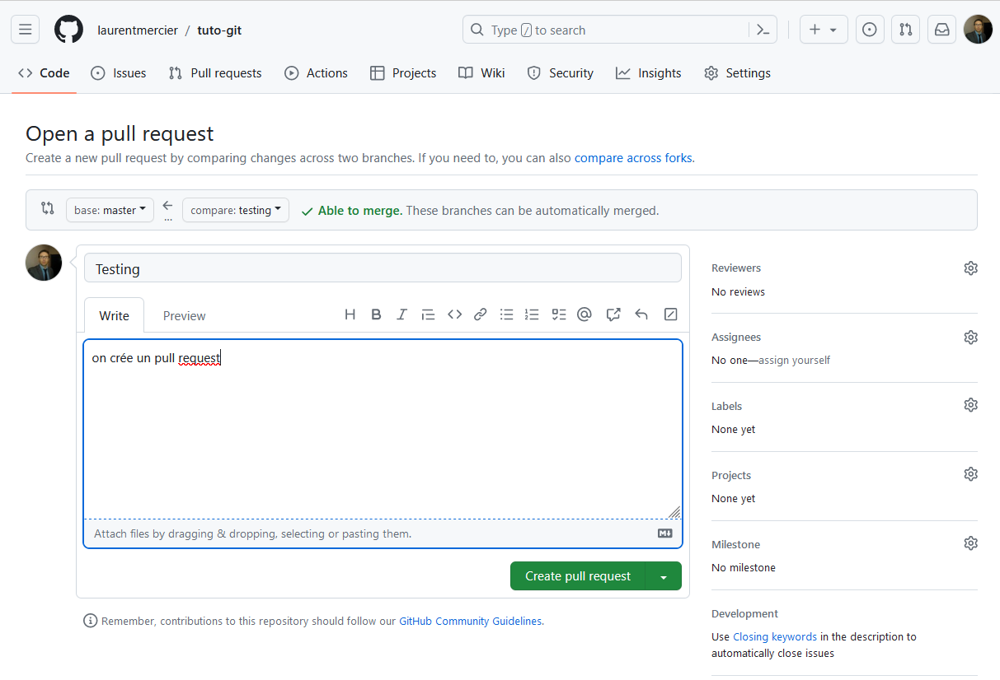
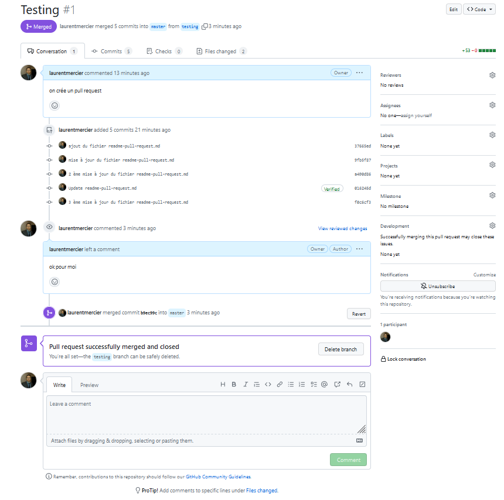

Créer une nouvelle branche
```
$ git branch testing
```
voir les logs
```
$ git log --oneline --decorate
```
Pour basculer sur une branche testing
```
$ git checkout testing
```

ajouter un fichier puis commiter (ici en ligne de commande sinon via un IDE comme IntelliJ)

$ vim ajout du fichier readme-pull-request.md
$ git commit -a -m 'ajout du fichier readme-pull-request.md'

Pour intégrer la branche au repository distant, 
il faut utiliser la commande git push. L'option -u indique à git de créer toutes les informations nécessaires pour rendre la branche traçable. Il faut ensuite spécifier le nom du repository 
distant (par défaut, il se nomme origin) et le nom de la branche.
```
$ git push -u origin testing
```

Sur le site  GitHub, on va créer un Pull Request :



une ligne supplémentaire ajoutée dans le fichier readme-pull-request.md via l'interface web de GitHub

En local sur ma branche, faites les commandes suivantes 
```
git fetch
``` 
suivi
```
git merge
```
On modifie la ligne
```
une ligne supplémentaire ...
```
par
```
une ligne supplémentaire ajoutée dans le fichier readme-pull-request.md via l'interface web de GitHub
```

puis on commite et on push
```
$ git commit -a -m '3 ème mise à jour du fichier readme-pull-request.md'
```

Du côté GitHub, on valide les changements du 'pull request' comme préciser dans la copie d'écran :



Voilà un pull request réalisé avec GitHub !


